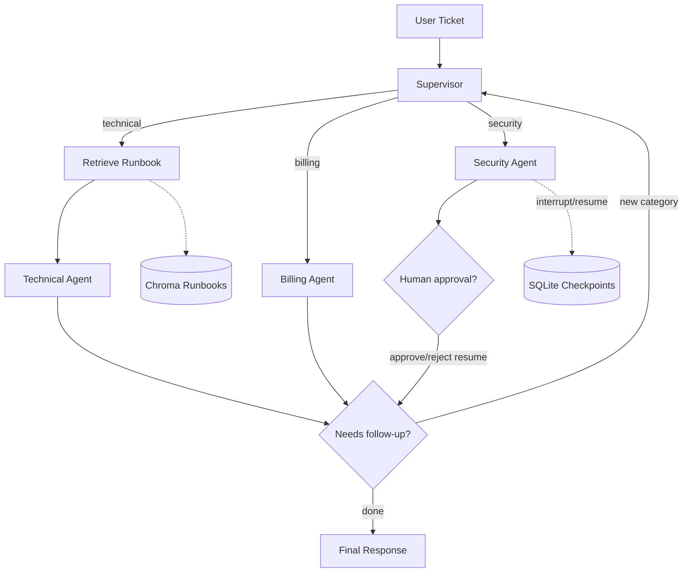

# Ops Agent

Ops Agent adalah eksperimen multi-agent IT/ops berbasis LangGraph untuk routing ticket, tool calling, RAG runbook, human-in-the-loop approval, dan checkpoint persistence.

Project ini adalah lanjutan dari [support-agent](https://github.com/cjoyy/support-agent): lanjutan dari project sebelumnya, fokus eksplorasi LangGraph untuk orchestration multi-agent yang lebih kompleks.

## Architecture



## Konsep LangGraph Yang Ditonjolkan

| Konsep | Implementasi |
| --- | --- |
| `StateGraph` | Graph utama mengatur supervisor, retrieval node, dan agent nodes. |
| State schema | `GraphState` menyimpan messages, category, follow-up state, resolved categories, dan runbook context. |
| Reducer `add_messages` | Field `messages` otomatis mengakumulasi percakapan antar node. |
| Conditional edges | Supervisor routing ke technical/billing/security, dan agent handoff balik ke supervisor jika perlu. |
| Tool calling | Technical agent memakai `restart_service`; billing agent memakai `check_invoice` dan `refund_policy`. |
| RAG | Technical route mengambil konteks dari runbook IT/ops di ChromaDB. |
| Human-in-the-loop | Security agent memakai `interrupt()` untuk approval manual sebelum action sensitif. |
| Checkpointing | `SqliteSaver` menyimpan state ke `checkpoints.sqlite`, termasuk resume lintas proses. |
| Evaluation | `eval_routing.py` mengukur akurasi routing supervisor terhadap golden dataset. |

## Setup & Run

```powershell
python -m venv venv
.\venv\Scripts\Activate.ps1
pip install -r requirements.txt
```

Buat `.env` dari contoh:

```powershell
Copy-Item .env.example .env
```

Isi:

```env
GROQ_API_KEY=your_groq_api_key
```

Build index runbook satu kali sebelum menjalankan ticket technical:

```powershell
python rag_setup.py
```

Jalankan aplikasi utama:

```powershell
python main.py "Service auth-api saya stuck, gimana cara restart yang benar?"
```

Contoh ticket security akan meminta approval manual di terminal:

```powershell
python main.py "Ada yang coba login ke akun saya dari lokasi asing"
```

Untuk verifikasi SQLite persistence lintas proses:

```powershell
python test_persistence.py
python test_resume_later.py
```

Untuk evaluasi routing supervisor:

```powershell
python eval_routing.py
```

## Hugging Face Spaces

Space ini dikonfigurasi memakai Docker SDK. File penting untuk deploy:

- `Dockerfile` menjalankan web app Gradio di port `7860`.
- `app.py` adalah UI Hugging Face Spaces.
- `README.md` punya metadata `sdk: docker` dan `app_port: 7860`.

Set secret berikut di Hugging Face Space:

```text
GROQ_API_KEY=your_groq_api_key
```

Deploy target:

```text
https://huggingface.co/spaces/cjoyy/ops-agent
```

Untuk menjalankan container lokal:

```powershell
docker build -t ops-agent .
docker run --env-file .env -p 7860:7860 ops-agent
```

## Hasil Eval Routing Accuracy

Golden dataset berisi 30 ticket IT/ops, termasuk beberapa ticket ambigu. Hasil terakhir:

```text
Accuracy: 90% (27/30)
```

## Known Limitations

- Ticket password reset internal dan akun terkunci karena login gagal kadang diklasifikasikan sebagai `technical`, padahal golden label saat ini `security`.
- Ticket billing portal yang mengandung gejala UI seperti refresh/error bisa condong ke `technical`, walaupun beberapa kasus bisnis lebih cocok `billing`.
- Follow-up detection masih memakai LLM judgement langsung, jadi hasil handoff bisa bervariasi antar run.
- RAG index harus dibuat dulu dengan `python rag_setup.py`; kalau belum, technical agent tidak punya konteks runbook yang kuat.
- Tool yang tersedia masih dummy dan belum mengeksekusi operasi produksi sungguhan.
